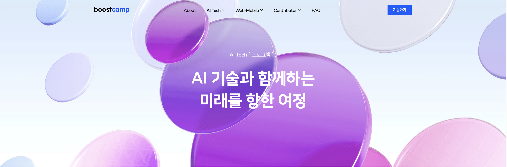

<!-- ### 부스트캠프 AI Tech 6기 준비 및 합격 후기 -->

 올해 들어 여러 일로 가장 바쁜 달이었던 8월, 어느날 인스타그램을 하던 중 네이버 커넥트 재단에서 운영하는
부스트캠프 AI Tech 6기 모집 광고를 보게 되었다.

약 한 달 반 동안의 준비 끝에 결과적으로 부스트캠프 AI Tech 6기 - KDT 전형, NLP 트랙으로 최종 합격하게 되었고,
이 과정 동안 나름 최선을 다해 준비했기에 그 과정을 기록하고 다음 기수 지원을 준비하는 분들에게 작은 도움이 될까 하여
후기를 적어본다.

<a href="https://boostcamp.connect.or.kr/">Boostcamp 홈페이지</a>
  
<!-- 배경 설명 및 지원 동기, 지원까지의 고민 -->
# 1. 간단한 배경 및 지원 동기
<!-- 전공은 어문계열, 졸업 이후 번역가 및 음악가로 활동하다가 실시간 라이브 번역용 소프트웨어 개발을 해보고 싶어
프론트엔드 개발에 발을 들이게 됨 -->
필자는 학부를 어문계열로 졸업하였고, 잠시 타 대학 음악 학부를 다녔던 경험이 있다. 다소 늦은 나이로 졸업한 이후 음악 활동과 프리랜서 번역가 활동을 병행하던 중, 우연한 계기로 K-POP 등 라이브 이벤트 실시간 자막 분야에 발을 들여놓게 되었다. 해당 업무의 특성상 다수의 번역가가 빠르게 작업할 수 있는 온라인 툴의 필요성을 느껴 약 2년 전에 처음으로 웹 개발을 시작하게 되었다.

이후 점차 관련 분야로 사업 범위를 확장해야 할 필요성을 느끼던 중, AI/ML 분야야말로 획기적인 성능 향상을 가져올 수 있는 분야라고 생각되어 부스트캠프 AI Tech 광고를 보고 바로 지원하게 되었다.

<!-- 유명 부트캠프 중 AI 부트캠프는 네이버 부스트캠프 뿐이었고, 이외의 다른 부트캠프들은 마음에 들지 않아 네이버 부스트캠프만 지원 -->
문제는 광고를 봤을 때는 이미 1차 선발 테스트까지의 기간이 한 달도 남지 않았었고, 웹 개발을 공부하며 JavaScript는 익숙한 상태였지만 Python 언어 자체를 한 번도 써 보지 않았다는 사실이었다. 또한 고등학교 때 문과 수학을 공부한 것이 마지막인 데다가 CS 지식이 전무한 상태에서 과연 합격할 수 있을까 확신이 들지 않았다. 이러한 상태에서 한 달 가량의 시간을 온전히 투자해 테스트를 준비할 가치가 있을까에 대해 고민이 들었지만, 어차피 언젠가는 뛰어들어야 할 분야라고 생각되어 짧은 고민 끝에 바로 지원서를 작성하게 되었다.
   

# 2. 지원 과정
<!-- 실제 준비한 자료들 쓰기 (링크들 포함) -->
<!-- 자기소개 -->
가장 먼저 지원서를 작성해야 했는데, 지원서를 작성하며 중점적으로 강조했던 부분들은 아래와 같다.

<b>- 지원 동기</b>

그동안 네이버의 AI 서비스들을 사용하며 느꼈던 타사의 AI 서비스와 차별화된 강점을 이야기하며, 이러한 기술을 보유한
네이버에서 진행하는 AI Tech 부스트캠프에 꼭 참여하고 싶다는 부분을 어필했다.

<b>- 개발 관련 경험</b>

위에서 언급했던 웹 애플리케이션 개발 경험을 위주로, JavaScript, React나 AWS, NAVER / Google API 활용 등 실제로 학습하고 서비스에 활용하였던 개발 관련 경험을 구체적으로 언급하였다. 또한 해당 애플리케이션을 구현하는 과정에서 미국 빅테크 기업에서 소프트웨어 엔지니어로 근무중인 친형의 도움을 받은 사실도 언급했는데, 실력을 과장해 부풀리기보다는 신뢰성 있는 자기소개가 중요하다고 생각했기 때문이다.

<b>- 자기 주도 학습 경험</b>

먼저 웹 애플리케이션을 개발하고 배포하는 과정에서 얻은 모든 지식들을 독학한 사실을 언급하였고, 꼭 개발 분야가 아니더라도 음악 프로듀서로 활동하는 과정에서 필요한 지식을 독학한 사례 등을 포괄적으로 언급했다.

<b>- 동료와의 협업 과정 경험</b> 

이 부분 또한 개발자로서의 경력은 아니지만, 음악 활동을 할 때 팀 리더로 활동했던 경험을 언급하며 협업을 원활하게 진행할 수 있음을 어필하였다.
<!-- 포트폴리오 -->

<b>- 포트폴리오 제출</b>

사실 나는 취업 준비를 위한 개발자 포트폴리오 같은 것을 따로 준비해 본 적이 없었고, 다른 문항에서 나에 대한 소개는 충분히 했다고 생각되어 내가 실제 제작한 서비스나 웹사이트, 사이드 프로젝트 등을 하나의 PDF에 모두 소개하는 형태로 제작하여 첨부하였다. 내용이 많지는 않았지만 실제 현업에서 사용되고 있는 서비스라는 점을 강조하였고, 많은 지원서를 봐야 하는 심사위원의 편의를 고려하여 최대한 깔끔하고 가독성 있게 작성하기 위해 노력했다.

이와 별도로 링크를 제출할 수 있었는데, 링크에는 역시 개발 포트폴리오는 아니지만 나의 역량을 보여줄 수 있다고 생각하여 발매한 음원 뮤직비디오 링크 또한 제출하였다.

<b><u>*** KDT 전형 준비 과정의 변수들</u></b>

부스트캠프는 총 240명의 선발 인원 중 약 200명을 KDT 전형을 통해 선발하기 때문에, 합격 확률을 높이고 싶다면 본인이 KDT 전형 지원 자격을 갖추었는지 확인하고 내일배움카드를 발급받아 위 전형으로 지원하는 것이 훨씬 유리하다.  그런데 내일배움카드를 발급받는 과정에서 자격을 소명하는 등의 절차가 생각보다 오래 걸릴 수 있고, 실제로 은행에 가서 카드를 발급받는 과정에서도 배송 문제 등 돌발 상황이 많이 발생했다. 그래서 꽤 일찍 내일배움카드 신청을 시작했는데도, 실제 발급받기까지는 한 달 넘는 시간이 걸렸다.  따라서 KDT 전형으로 지원하고자 한다면 반드시 미리미리 준비할 것을 추천한다.
  

<!-- # 1차 시험 준비 -->
# 3. 1차 AI 역량 테스트
<h3>준비 과정</h3>
지원 마감 약 일주일 후인 9월 19일, 1차 AI 역량테스트가 치러졌다. 
<!-- CS 지식 테스트 -->
1차 AI 역량 테스트는 약 20문제 정도의 AI 및 관련 수학 지식을 묻는 객관식 문항과, 5문제의 코딩 테스트로 이루어져있다.
<!-- 6기 pre-course 2회 학습 및 기수별 문제 풀이 -->
나는 사실 부스트캠프 지원 이전에는 코딩 테스트를 이전에 한 번도 본 적이 없었고, 문제 풀이도 거의 해 본 적이 없는 상황이었다. 

또, 코딩테스트 응시 가능 언어는 Python, C++, JAVA 뿐이었는데 나는 이전에는 오직 JavaScript만을 썼었기에, Python도 처음부터 공부해야 했다. 
다행히 시험을 준비하기 위한 Pre-course에 Python 기초 강의도 포함되어 있어서, 해당 강의를 들으며 프로그래머스의 Lv.0, Lv.1 쉬운 문제들을 하루에 20 ~ 30문제 정도씩 빠르게 풀며 Python 언어 자체에 익숙해지는 데 집중했다. 이후에 조금 익숙해진 후에는 Pre-course에 포함되어 있는 코딩 문제들을 보며, 쉬운 문제는 직접 풀고 어려운 문제는 다른 사람들의 풀이를 참고해 공부했다.

그리고 1차 테스트까지 약 2주 남은 상황에서 아무리 열심히 코테를 공부해도 한계가 있을 거라는 생각이 들었고, 그럴 바에는 확실히 맞출 수 있는 수학 및 AI 문항들을 더 공부하자는 생각을 했다. 다음은 AI 기초 테스트를 위해 공부한 내용이다.
- Boostcourse에서 제공하는 Pre-course에서 수학 및 AI 파트 2회 수강하며, 강의에 나오는 부족한 수학 및 CS 기본 지식들은 그때그때 서치해가며 공부하고 노트에 정리
- YouTube에서 "모두를 위한 딥러닝" 강좌 수강 (<a href="https://www.youtube.com/watch?v=BS6O0zOGX4E&list=PLlMkM4tgfjnLSOjrEJN31gZATbcj_MpUm&ab_channel=SungKim">강좌 링크</a>) :  Pre-course의 딥러닝 파트는 아주 친절하게 초심자를 위해 설명해주지는 않는 느낌이어서, 해당 강좌의 lecture 파트들만을 들으며 기본 개념들을 이해하기 위해 노력했다.
- Boostcourse에서 이전 기수들을 포함한 Pre-course 자가진단 문항들을 풀며, 문제 해결에 필요한 개념들을 찾아보며 공부했다. 개인적으로 이 과정이 가장 많은 도움이 된 것 같다!
<!-- 모두를 위한 머신러닝 강좌 링크 -->
<!-- 부족한 수학 및 CS 기본 지식은 Chat GPT, Wikipedia, YouTube 강좌 등 그때그때 search를 통해
공부하고 노트에 정리해 놓음 -->

<!-- 코딩 테스트 -->
<!-- 프로그래머스 어느 정도 문제 풀었는지 -->

<h3>1차 시험 당일</h3>
<!-- 1차 테스트 당일 : 생애 첫 코딩 테스트, 긴장, 결과 -->
시험은 <a href="https://programmers.co.kr/">프로그래머스</a> 환경에서 이루어지고, 일체의 외부 인터넷 검색이나 외부 IDE 사용이 금지되기 때문에 미리 적응하기 위해 프로그래머스에서 코딩테스트 연습 문제들을 풀었다.

또, 부정 행위를 방지하기 위해 핸드폰을 삼각대에 거치해 놓고 실시간 응시 화면을 전송하는 것은 물론 화면 공유 등 꽤 보안이 철저하기 때문에, 이러한 환경에 적응하고 미리 안내 메일에 따라 환경 테스트를 진행하여 변수를 없애는 것이 시험 전 평정심 유지에 좋다. 시험 링크에 입장하면 책상 위를 비워야 하기 때문에, 접속 전 마지막으로 정리 노트를 보며 개념 복습을 하고 접속 이후에는 15분 전? 정도까지 인터넷 검색은 보는 것은 허용되어 Pre-course 자가진단 문제들을 복습했다. 
(생전 처음 코딩테스트를 보는 것이어서 이때는 정말 x 100 많이 떨리고 심장이 두근거렸다.. ㅎㅎ)

이윽고 시험이 시작된 후, 나는 애초 계획했던대로 AI 문제들을 먼저 빠르게 풀기 위해 객관식 부분으로 스킵했다.  그런데 웬 걸? 비록 문과 + 비전공자이긴 하지만, 이 부분은 열심히 공부했고 자가진단 문제들의 수준 정도면 충분히 풀 수 있겠다 싶었지만, 문제들이 생각보다 디테일하고 까다로웠다. 자세한 내용을 유출할 수는 없지만, 자가진단 문제들보다 훨씬 까다로운 느낌이었다. 물론 범위는 Pre-course에 포함된 내용들이었지만, 강의에 나온 개념들을 구체적으로 정확히 알고 응용할 수 있어야 풀 수 있는 문제들이었다. 물론 전공자 분들이나 AI, 관련 수학 지식을 미리 공부하셨던 분들 입장에서는 크게 어려운 문제가 아니었겠지만, 체감상 선형대수학 계산 문제 그리고 AI 이론 모두 자가진단보다는 더 까다로워서 예상을 훌쩍 넘겨 약 50분 이상의 시간을 소비하게 되었다. 만약 수학 및 AI 이론 공부를 열심히 하지 않았더라면 크게 당황할 뻔했다.

이후 코딩테스트 문제를 보았는데, 아무래도 코딩테스트는 처음부터 쉬운 문제만 풀자는 마음가짐으로 준비했다보니 2문제 밖에 풀지 못했다. 문제 내용은 정확히 기억이 나지 않지만, 난이도 순으로 배치되어 있을 것 같아 앞 두 문제만 보았고, 난이도는 프로그래머스 어려운 Lv.1 ~ 쉬운 Lv.2 정도로 느껴졌다.  
그리고 부끄럽게도 한 문제는 거의 하드코딩 수준으로 풀다보니 정답은 구했을 것 같지만 나의 코테 역량이 많이 부족함을 절실히 느낀 1차 시험이었다. 
2시간이 20분처럼 느껴진 시험이 끝나고, 생각보다 어려운 난이도에 망했다 싶으면서도 준비 기간 동안 최선을 다했기 때문에 후련한 마음이 들었다.

# 4. 2차 코딩 테스트
<h3>준비 과정</h3>
1차 합격 발표는 약 1주일 후에 나오는데, 2차 코딩 테스트까지 시간이 또 3주 정도밖에 없기 때문에 떨어질 수 있다고도 생각하면서도 코딩테스트를 연습했다. 정말 감사하게도(!) 1차 합격 통지를 받게 되었고, 바로 본격적으로 2차 코딩 테스트 준비를 시작했다. 
<!-- # 2차 코딩 테스트 준비 -->
2차 시험에는 오직 코딩 테스트 문제만 8개가 출제되기 때문에, 피해갈 수 없는 
<!-- 1차 합격 발표 및 이후 공부 스케쥴 -->
<!-- 백준 알고리즘별 풀이 페이지, solved 참조  -->
<!-- 프로그래머스 문제 풀이 -->
<!-- Pre-course 자가진단 문제 복습 및 관련 알고리즘 공부 & 유사 문제 풀이 -->
<!-- 비전공자 마인드컨트롤 : 오픈카톡은 들어가지 않음 -->

# 5. 최종 합격 발표 및 준비 기간
<!-- 최종 합격 발표 및 합류 전 예습-->
<!-- 부스트캠프에서 간략한 목표 -->